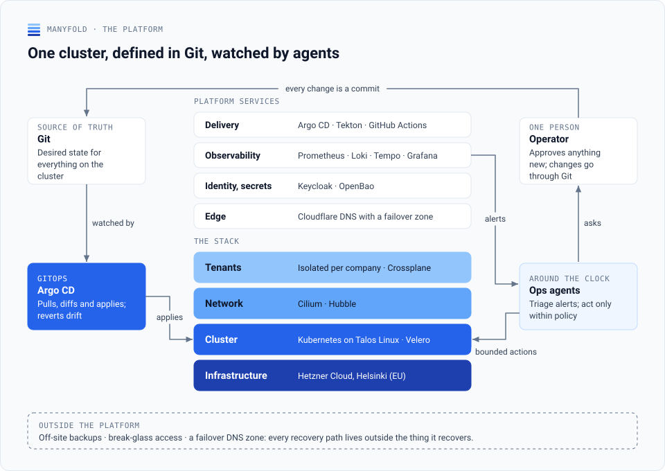

# Thomas Berg von Linde

Platform engineer and architect in Copenhagen. 25 years in software, mostly in systems where downtime is expensive: rail ticketing, pensions, insurance, tax. Independent through [Manyfold](https://manyfold.dk) since 2012.

## What I work on

I build and operate Kubernetes platforms: GitOps delivery, observability, identity and secrets, backup and recovery, and the habits around them that keep a platform boring in the good sense.

I also run a production platform of my own on European infrastructure. It is Kubernetes on Talos Linux at Hetzner in Helsinki, delivered with Argo CD, observed with Prometheus, Loki, Tempo and Grafana, with OpenBao for secrets, Keycloak for identity, Velero for backups and Crossplane for tenant provisioning. AI agents handle first-line operations around the clock; I handle what needs a person. The live status, the stack and how it is run are at [manyfold.dk](https://manyfold.dk).

<picture>
  <source media="(prefers-color-scheme: dark)" srcset="diagrams/platform-dark.svg">
  
</picture>

How delivery, agentic operations and tenant isolation work is drawn out on the [Manyfold organisation page](https://github.com/manyfold-dk).

## Recent work

- **UFST, Danish Tax Agency (2026):** production operations for high-volume citizen letter generation on AWS.
- **ATP (2026):** Kubernetes platform engineering for the national pension provider.
- **DSB, Danish State Railways (2021–2026):** tech lead and architect on ticketing systems handling more than 2 million transactions a day with sub-150 ms responses; built the Azure platform for the microservices as code.

## About the repositories here

Most of what I write lives in client repositories or in the [manyfold-dk](https://github.com/manyfold-dk) organisation, where the platform's running configuration stays private. What can be shared is: estate-baseline holds the tooling that keeps a set of repositories to one standard — conformance checks against a version manifest, generated ADR indexes, a publish-check secret scanner and a mailbox for handoffs between coding agents — all failing CI on drift rather than warning. More will follow as it is scrubbed for release. The public forks are tools I run and occasionally patch. Architecture decisions and write-ups from the platform are published on [manyfold.dk](https://manyfold.dk).

<picture>
  <source media="(prefers-color-scheme: dark)" srcset="diagrams/estate-dark.svg">
  
</picture>

## Contact

[manyfold.dk](https://manyfold.dk) · [LinkedIn](https://www.linkedin.com/in/tbvl/) · thomas@manyfold.dk
